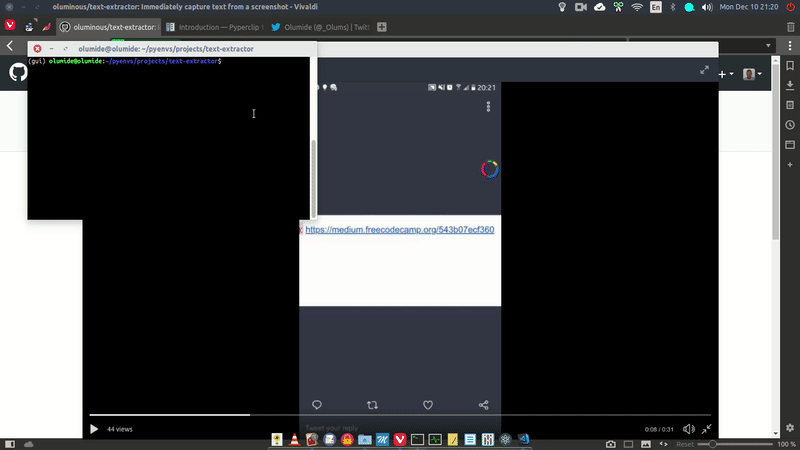

# Immediately extract text from a region of interest screenshot

Sequel to my [roi-screenshot](https://github.com/oluminous/roi-screenshot) project. Was finally able to do [this](https://twitter.com/_Olums/status/1066411959950692353) with my laptop. 

## Requirements
  - Python 3.6+
  - [Tesseract](https://github.com/tesseract-ocr/tesseract/wiki)
  - Packages in the requirements.txt file: ```pip install -r requirements.txt```
  
    On Linux, ```pyautogui``` has some extra dependencies. Simply run the following commands from the terminal to install them:
    ```sudo pip3 install python3-xlib```, 
    ```sudo apt-get install scrot```, 
    ```sudo apt-get install python3-tk```, and 
    ```sudo apt-get install python3-dev``` 
  
## How to Use
  1. Execute the script: ```python extractor.py```
  2. As explained in [roi-screenshot](https://github.com/oluminous/roi-screenshot), click the edges of the intended screenshot.
  3. The text in the screenshot will be displayed on the terminal and also copied to your clipboard.

## Example


 

